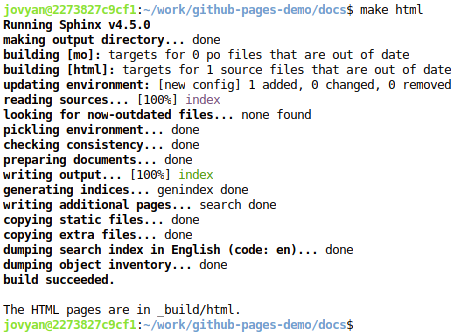
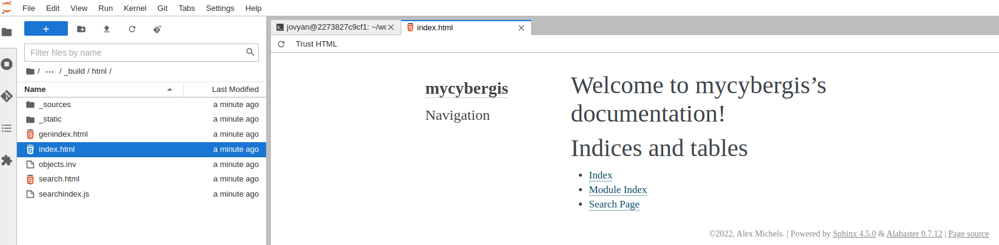

Sphinx-Quickstart
=================

First, we are going to setup the basics with the ``sphinx-quickstart`` command. `The Sphinx "Getting Started" page <https://www.sphinx-doc.org/en/master/usage/quickstart.html>`_ offers more details beyong this walkthrough.

.. warning:: 
    Unfortunately, Sphinx pages don't seem to work completely on JupyterHub or Jupyterlab so I recommend doing this work locally. Jupyterlab seems to work for individual simple pages (hence the screenshots below), but not in general.

1. **Fork and clone the repo** The repository for this work is `https://github.com/cybergis/github-pages-demo <https://github.com/cybergis/github-pages-demo>`_. Fork it on Github and clone the fork to your laptop. **It is important that you fork it because later we will be deploying a page with Github Pages.**
   
Open a terminal and change directories to where you want to do this work::

   cd <some path>

Clone the repository and checkout the ``main`` branch::

    > git clone https://github.com/cybergis/

    github-pages-demo
    Cloning into 'github-pages-demo'...
    remote: Enumerating objects: 41, done.
    remote: Counting objects: 100% (41/41), done.
    remote: Compressing objects: 100% (32/32), done.
    remote: Total 41 (delta 3), reused 41 (delta 3), pack-reused 0
    Unpacking objects: 100% (41/41), 255.51 KiB | 1.84 MiB/s, done.

    > cd github-pages-demo/
    > git checkout main

    ranch 'main' set up to track remote branch 'main' from 'origin'.
    Switched to a new branch 'main'

2. **`sphinx-quickstart`**

Create a folder ``docs`` within the ``github-pages-demo`` folder::

    > mkdir docs

Run the ``sphinx-quickstart`` command:

    > sphinx-quickstart

The answers to the questions are (or see screenshot below)::

    > Separate source and build directories (y/n) [n]: n
    > Project name: <whatever name you want>
    > Author name(s): <your name>
    > Project release []: <whatever version you want>
    > Project language [en]: en (or the language of your choice, but we will use English)

.. figure:: ../_static/img/SphinxQuickstart.png

    A screenshot of the sphinx-quickstart command

3. **Install packages**
Create a file called "requirements.txt" in `docs/` and copy/paste the following::

    folium
    geopandas>=0.9.0
    ipython
    ipython_genutils
    markupsafe==2.0.1
    myst-parser
    nbsphinx
    nbsphinx-link
    shapely
    sphinx
    sphinx-markdown-builder
    sphinx-rtd-theme

Once you have this file, install the packages with pip::

    > pip install -r requirements.txt

**NOTE: Make or move `requirements.txt` to `docs/`** This will be necessary later.

4. **`make html`**

Now, we are going to make the HTML output for the `sphinx-quickstart` output. From within `docs/`::

    > make html

You can see a screenshot of the output below:

   A screenshot of the ``make html`` output.

Now, let's check out the result. In the file browser, go to ``github-pages-demo > docs > _build > html`` and open "index.html". You can see the output below:

   A screenshot of the HTML output

5. **A few changes to conf.py**

Now, there are a few key changes we are going to make to the conf.py file. In the file browser, find "conf.py" at the path: github-pages-demo/docs/conf.py. We are going to make a couple key changes. 

Lines 13-15 should look like this::

    # import os
    # import sys
    # sys.path.insert(0, os.path.abspath('.'))

replace them with::

    import os
    import sys
    sys.path.insert(0, os.path.abspath('../'))

This adds the path "github-pages-demo" folder to the Python path. 

Next, you should see the extensions array in Lines 33-34. Replace it with::

    extensions = [
        'sphinx.ext.autodoc',
        'sphinx.ext.doctest',
        'sphinx.ext.todo',
        'sphinx.ext.coverage',
        'sphinx.ext.mathjax',
        'sphinx.ext.napoleon',
        'sphinx.ext.viewcode',
        'sphinx.ext.githubpages',
        'sphinx_markdown_builder',
        'sphinx_rtd_theme',
        'myst_parser',
        'nbsphinx',
        'nbsphinx_link'
    ]

These are some key extensions and packages we will use for our site.

Our last change is: replace the ``html_theme`` (line 63 after the added extensions) with the below::

    html_theme = "sphinx_rtd_theme"

This is the Sphinx Read The Docs Theme.

For fun, you can download a logo image into the ``docs/_static`` folder and add the lines::

    html_favicon = '_static/favico.ico'  # change to the name of your image
    html_logo = '_static/favico.ico'  # change to the name of your image

to your conf.py. This isn't necessary though. Save these changes.

6. **make html: Part 2**

Go back to the terminal (and if needed change directories to our docs folder `cd github-pages-demo/docs`). Run the `make html` command again. Now, checkout your index.html file again:

.. figure:: ../_static/img/SphinxRTD.png

   A screenshot of the Sphinx Read The Docs Theme.

**NOTE:** If you ever had issues with the page seemingly note updated, check that you've saved your files and then you can use ``make clean`` to clear out the ``_build`` folder and run ``make html`` again to re-build.